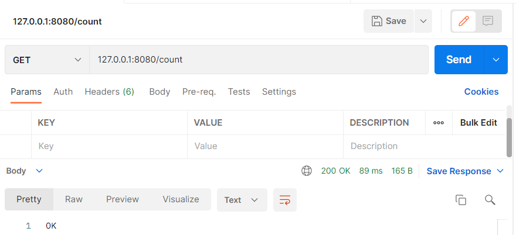
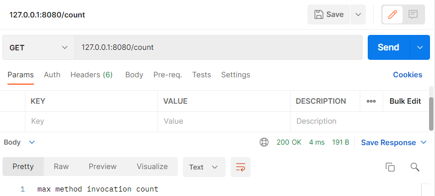

# java_skbCourse_hw9
## Демонстрация работы
`127.0.0.1:8080/count`
Первые 5 вызовов (Изначально настроено в `resources/application.yml)`)

После:

## Запуск
1. Выполните следующие команды:
`mvn package`
`mvn spring-boot:run`